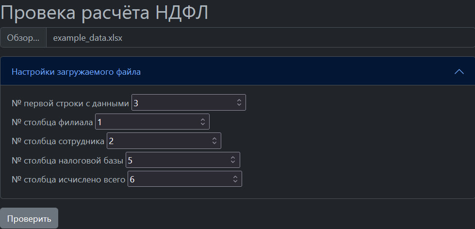

# Сервис для проверки корректности исчисления НДФЛ
Тестовое задание для РусГидро
[Текст тестового задания](test_task_text.md)
[Пример входных данных](example/example_data.xlsx)
[Форма для выходных данных](example/rept_header.xlsx)


## Как установить локально
Python3 должен быть установлен. Рекомендуется создать виртуальное окружение и все последующие действия совершать в нём.

### Быстрая установка
Запустите файл `local_installer.py` в директории проекта:
```bash
python local_installer.py
```
Автоматически установятся зависимости из файла `requirements.txt`, создастся файл `.env` (если такого ещё нет в директории), содержащий cгенерированный секретный ключ django, будут проведены миграции. 

### Ручная установка
- Установите зависимости:
    ```bash
    python -m pip install -r requirements.txt
    ```

- Создайте файл `.env`, содержащий переменные окружения (список переменных окружения можно найти далее)

- Выполните миграции:
    ```bash
    python manage.py migrate
    ```

### Переменные окружения
- `DJANGO_SECRET_KEY` (обязательно) - секретный ключ django
- `DEBUG` (опционально) - режим отладки (по умолчанию True)
- `ALLOWED_HOSTS` (опционально) - разрешённые хосты (по умолчанию любые)
- `DJANGO_DATABASE` (опционально) - настройки базы данных (по умолчанию примет значение переменной DEFAULT_DATABASE)
- `DJANGO_STATICFILES_DIRS` (опционально) - список дополнительных папок статиков (по умолчанию пустой список)

## Как использовать
- Выберите файл с таблицей расчета НДФЛ
- Если столбцы в вашем файле расположены не так, как в [примере входных данных](example/example_data.xlsx), в настройках можно указать с какой строки начинаются данные и номера столбцов (на скриншоте настройки по умолчанию).
- Нажмите на кнопку `Проверить`